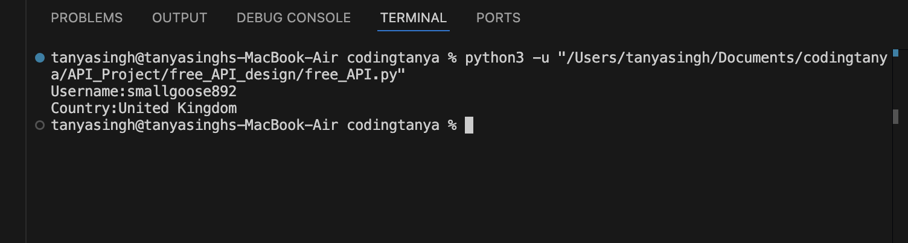

#  Random User API Project

##  Overview

This project is a simple Python-based application that fetches random
user data from a public API.\
It extracts useful information like **username** and **country** and
displays it in the terminal.

------------------------------------------------------------------------

## Features

-   Fetch random user data using API\
-   Extract username and country\
-   Simple and clean Python implementation\
-   Basic error handling

------------------------------------------------------------------------

##  Tech Stack

-   Python\
-   Requests Library\
-   REST API

------------------------------------------------------------------------

##  Project Structure

random-user-api/

├── main.py\
├── requirements.txt\
├── README.md\
└── .gitignore

------------------------------------------------------------------------

##  Installation

1.  Clone the repository: git clone
    https://github.com/your-username/random-user-api.git

2.  Navigate to the project folder: cd random-user-api

3.  Install dependencies: pip install -r requirements.txt

------------------------------------------------------------------------

## Usage

Run the program: python main.py

------------------------------------------------------------------------

## Sample Output

Username: lazykoala381\
Country: New Zealand

-------------------------------------------------------------------------
## Sample Output

------------------------------------------------------------------------

##  API Used

https://api.freeapi.app/api/v1/public/randomusers/user/random

------------------------------------------------------------------------

##  What I Learned

-   How to work with APIs in Python\
-   JSON parsing and data extraction\
-   Handling API responses\
-   Writing clean and structured code

------------------------------------------------------------------------

##  Future Improvements

-   Add more user details (email, profile picture, etc.)\
-   Convert into a Flask API\
-   Build a simple UI using Streamlit

------------------------------------------------------------------------

## Author

Tanya Singh
